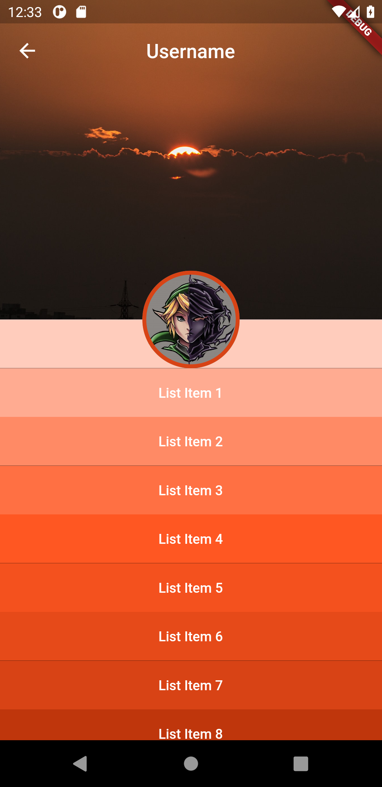

# September 17, 2021 - Overlapping Content with SliverAppBar

<a href="images/20210917.png"></a>

## Implementation Notes

There were two main things I wanted to try to do as part of this:
1. Twitter's mobile header has an app bar with the user's avatar overlapping it. I wanted to figure
   out how to actually do that.
2. I wanted to try out some interactions with the [`ScrollController`](https://r.btdev.org/2a) and
   see how that worked

### Overlapping Widgets

I was already familiar with the [`Stack`](https://r.btdev.org/2b) widget, which allows you to stack
multiple widgets on top of one-another, so that was a solved problem there. Alignment within the
Stack is done with [`Positioned`](https://r.btdev.org/2c) (and I'm sure other widgets exist too).
What I wasn't sure how to do was to get that interacting as part of the app bar itself. Turns out
that you can do this with the `flexibleSpace` property on the [`SliverAppBar`](https://r.btdev.org/2d)
widget.

The code for this was heavily based on a [Gist](https://gist.github.com/vital-edu/e2976ad6ede98813b75ee44b1217cc96)
I found, created by [@vital-edu](https://gist.github.com/vital-edu). Their main code showed how to
stack items within the app bar.

I'm sure I've only scratched the surface with what you can do with `flexibleSpace`. Definitely more
to learn here in the future.

### Scroll Controllers

The scroll controller was used to change the relative size, position, and opacity of the avatar as
the user scrolls down the screen. Without that in place, at some point the avatar magically vanishes
off the screen before it has scrolled away (likely due to how Flutter doesn't build slivers that aren't
on the screen for optimization, although I don't know this for sure). This provides a smoother
transition. I wanted to both fade the image away as well as slowly shrink it. 

Scroll Controllers need to be in a [`State`](https://r.btdev.org/2e) object to be of any use, since
the state of the widget changes as you scroll (duh). It's also important to override the `initState()`
and `dispose()` methods so that you can properly initialize and dispose of that state controller. In
short, this means _we need to use a [`StatefulWidget`](https://r.btdev.org/2g), not a stateless one!_

In short, we:
* Initialize the scroll controller
* Add a listener to update the state as we scroll
* Bind our scroll controller to the [`CustomScrollView`](https://r.btdev.org/2f)
* Write `get` methods to set the various properties such as opacity, size, and positioning
* Dispose of the controller when we're done with it.

```dart
@override
void initState() {
  _scrollController = ScrollController()..addListener(() => setState(() {}));
}

@override
void dispose() {
  _scrollController.dispose();
}

// ...
@override
Widget build(BuildContext context) {
  return CustomScrollView(
    controller: _scrollController,
    // ...
  );
}
```

I wrote a method called `_relativeBetween(double min, double max)` to give me a relative number
between `min` and `max` depending on how far through the scroll I was, also taking into account how
far through the scrolling I should be before it kicks in. I only wanted the changes to take place
after scrolling 70% of the way through going through the app bar. There's probably a better way to
do this, but I did learn about [`lerpDouble()`](https://r.btdev.org/2h), which did save me some code.


## Image Attributions

* [Vivek Doshi](https://unsplash.com/photos/EdhmOmzBdoI)